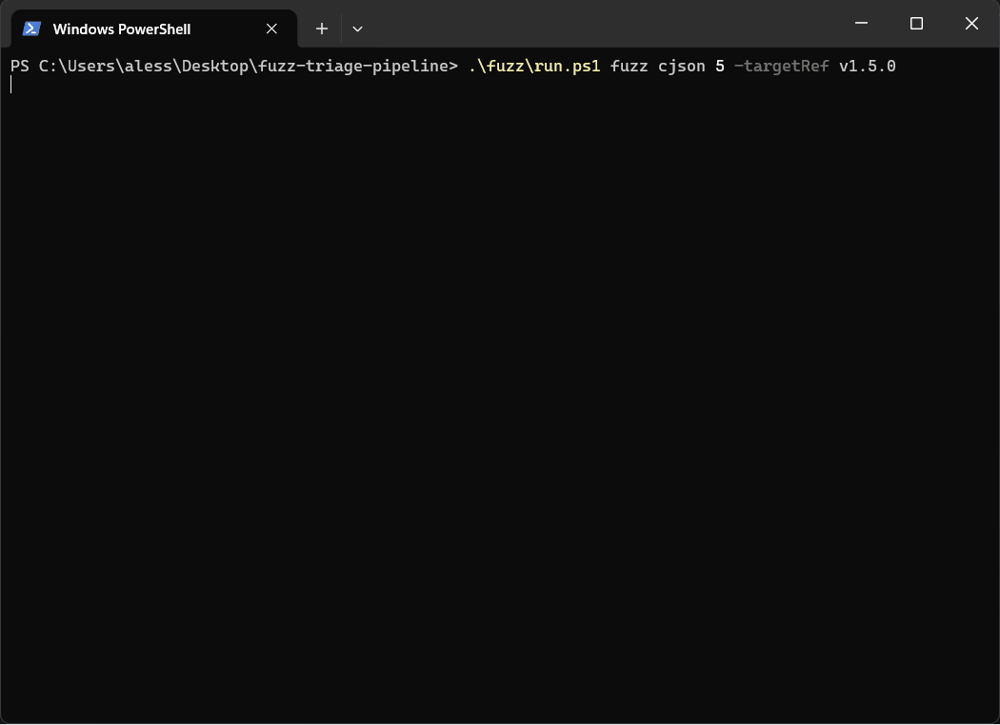

# Fuzz Triage Pipeline

A reproducible multi-target fuzzing and crash triage pipeline built to simulate a realistic vulnerability discovery workflow.

<p align="center">
  
</p>

<p align="center">
  <i>End-to-end fuzzing → crash → repro → minimization → triage workflow</i>
</p>

It supports automated target fetch/build, libFuzzer execution, crash capture, reproduction, minimization, triage, bucketing, root cause extraction, Markdown/JSON reporting, and optional per-run coverage artifacts.

---

## TL-DR

A reproducible fuzzing and crash-triage framework that:

- runs libFuzzer targets in isolated Docker environments
- captures, reproduces and minimizes crashes deterministically
- performs automated crash triage and stacktrace bucketing
- extracts root cause information from sanitizer output
- generates structured Markdown/JSON reports
- supports multi-target and multi-version validation

Designed to simulate a realistic vulnerability discovery workflow.

---

## What makes this non-trivial

Unlike simple fuzzing harnesses, this project focuses on the full vulnerability lifecycle:

- deterministic crash reproduction across runs
- automated input minimization preserving crash behavior
- stacktrace-based crash deduplication
- root cause extraction from sanitizer diagnostics
- structured triage output suitable for analysis or automation
- version-aware testing for comparing target behavior

The pipeline is built as a reusable framework, not a single-target setup.

---

## Why this project

This project was built to demonstrate a complete fuzzing workflow rather than a single harness or isolated proof of concept.

The goal is to show how a real target can move through the full lifecycle:

1. fetch and build the target
2. run fuzzing in a reproducible environment
3. capture crashing inputs
4. reproduce the crash deterministically
5. minimize the input
6. extract root cause and classify the issue
7. export structured reports and artifacts

The repository is intentionally organized as a reusable framework rather than a one-off target setup.

---

## Key features

- reproducible Docker-based environment
- automatic target fetch and build
- unified multi-target runner
- libFuzzer-based fuzzing pipeline
- automatic crash capture
- deterministic crash reproduction
- automatic crash minimization
- automatic crash triage
- stacktrace-based deduplication and bucketing
- automatic root cause extraction
- Markdown and JSON reports
- centralized sanitizer-aware diagnostics
- optional per-run coverage reporting with HTML export
- corpus reuse across runs

---

## Supported targets

Currently supported targets:

- `cjson`
- `sqlite`
- `yaml`

For `cjson`, both newer and older upstream refs can be tested through `-targetRef`.

Examples:

- newer comparison ref: `v1.7.17`
- legacy vulnerable ref: `v1.5.0`

This makes it possible to compare behavior across upstream versions without maintaining separate duplicated target definitions.

---

## Architecture overview

```text
Host CLI
  ↓
Docker environment
  ↓
Target fetch/build
  ↓
libFuzzer harness
  ↓
Corpus generation / reuse
  ↓
Crash capture
  ↓
Crash reproduction
  ↓
Crash minimization
  ↓
Crash triage
  ↓
Crash bucketing
  ↓
Root cause extraction
  ↓
Markdown / JSON reports
  ↓
Optional coverage artifact generation
```

---

## Design decisions

- Docker-based isolation ensures reproducibility across environments
- libFuzzer chosen for deterministic in-process fuzzing and sanitizer integration
- stacktrace bucketing used instead of raw crash hashing for better deduplication
- triage is separated from fuzzing to allow independent analysis workflows
- coverage is optional to keep the core pipeline lightweight

## Trade-offs

- optimized for clarity and reproducibility rather than maximum fuzzing performance
- limited to libFuzzer backend (no AFL++ abstraction yet)
- root cause extraction is heuristic-based and may require manual validation

---

## Repository layout
```
docker/                  Docker environment
fuzz/                    runner and fuzzing scripts
triage/                  repro, minimization, triage logic
scripts/                 shared framework helpers
targets/                 per-target integration
corpus/initial/          initial seed corpora
artifacts/runs/          per-run fuzzing artifacts
artifacts/repros/        repro artifacts
artifacts/minimized/     minimized crash artifacts
artifacts/reports/       Markdown/JSON reports
artifacts/coverage/      optional coverage artifacts
```

---

## Example workflow

A typical run looks like:

1. fuzz target `cjson` for N seconds
2. detect crash and save artifact
3. reproduce crash deterministically
4. minimize crashing input
5. extract root cause from ASan output
6. generate structured report

This mirrors a real vulnerability discovery workflow from fuzzing to triage.

---

## Quick start

1. Build the environment
```PoweShell
.\fuzz\run.ps1 build
```

2. Run a target
```PowerShell
.\fuzz\run.ps1 fuzz cjson 10 -targetRef v1.7.17
```

3. Reproduce the latest crash
```PowerShell
.\fuzz\run.ps1 repro cjson -Last
```

4. Minimize the latest crash
```PowrShell
.\fuzz\run.ps1 minimize cjson -Last
```

5. Generate triage report
```PowerShell
.\fuzz\run.ps1 triage cjson -Last
```

6. Show compact status
```PowerShell
.\fuzz\run.ps1 status cjson -Last
```

---

## Main commands

Fuzzing:
```PowerShell
.\fuzz\run.ps1 fuzz <target> [seconds] [-targetRef <ref>]
.\fuzz\run.ps1 demo-crash <target> [seconds] [-targetRef <ref>]
```

Triage workflow:
```PowerShell
.\fuzz\run.ps1 repro <target> -Last
.\fuzz\run.ps1 minimize <target> -Last
.\fuzz\run.ps1 triage <target> -Last
.\fuzz\run.ps1 status <target> -Last
```

Artifact inspection:
```PowerShell
.\fuzz\run.ps1 logs <target> -Last
.\fuzz\run.ps1 meta <target> -Last
.\fuzz\run.ps1 report <target> -Last
.\fuzz\run.ps1 report-json <target> -Last
.\fuzz\run.ps1 crashes <target> -Last
.\fuzz\run.ps1 repro-meta <target> -Last
.\fuzz\run.ps1 minimize-meta <target> -Last
```

Coverage:
```PowerShell
$env:FUZZPIPE_ENABLE_COVERAGE = "1"
.\fuzz\run.ps1 fuzz cjson 10 -targetRef v1.7.17
.\fuzz\run.ps1 coverage cjson -Last
.\fuzz\run.ps1 coverage-summary cjson -Last
.\fuzz\run.ps1 coverage-replay-log cjson -Last
Remove-Item Env:FUZZPIPE_ENABLE_COVERAGE
```

---

## Case study: cJSON v1.5.0 vulnerability analysis

This case demonstrates the full pipeline on a legacy vulnerable version.

Steps performed:

- fuzzing executed on `cjson v1.5.0`
- crash detected and persisted
- crash reproduced deterministically
- input minimized to smallest triggering payload
- root cause extracted from ASan output

Outcome:

- vulnerability type: heap-buffer-overflow
- affected function: `parse_string`
- minimized input size: 1 byte

This validates the pipeline's ability to move from fuzzing to actionable vulnerability insight.

---

## Real validated result

A real crash was found on the legacy vulnerable cJSON ref:

- target: `cjson`
- ref: `v1.5.0`
- crash origin: `real`
- crash type: `heap-buffer-overflow`
- root cause function: `parse_string`
- root cause location: `cJSON.c:660`
- repro status: `crashed`
- minimized from `4` bytes to `1` byte
- reduction: `75.0%`

Example run summary:
```
Target           : cjson
Latest run id    : 2026-03-17_022704
Mode             : normal
Target ref       : v1.5.0
Target version   : 1217ca9
Crashes          : 1
Report           : present
Repro            : present
Repro status     : crashed
Repro exit code  : 134
Minimize         : present
Minimize status  : minimized
Minimize exit    : 0
```

Example triage result:
```
Crash origin     : real
Raw crash type   : heap-buffer-overflow
Function         : parse_string
File             : /workspace/targets/cjson/src/cjson/cJSON.c
Line             : 660
Root cause score : 999
Root cause reason: asan summary; preferred over fallback stack scoring
Original size    : 4
Minimized size   : 1
Reduction %      : 75.0
```

Example stack excerpt:
```
#0 parse_string /workspace/targets/cjson/src/cjson/cJSON.c:660
#1 parse_object /workspace/targets/cjson/src/cjson/cJSON.c:1489
#2 parse_value /workspace/targets/cjson/src/cjson/cJSON.c:1188
#3 cJSON_ParseWithOpts /workspace/targets/cjson/src/cjson/cJSON.c:954
#4 cJSON_Parse /workspace/targets/cjson/src/cjson/cJSON.c:1013
#5 LLVMFuzzerTestOneInput /workspace/targets/cjson/harness.cpp:197
```

This is the main validation case for the repository because it demonstrates the full workflow on a real upstream issue path in the target code rather than only a synthetic demo crash.

## Comparison run

The same target was also validated on a newer upstream ref:

- target: `cjson`
- ref: `v1.7.17`


Observed result:

- long fuzzing run completed successfully
- no real crash observed in the validated run
- corpus expanded during execution
- coverage artifacts can be generated per run


This provides a useful comparison between a legacy vulnerable ref and a newer ref of the same project.

---

## Coverage reporting

Coverage reporting is optional and can be enabled per run through:
```PowerShell
$env:FUZZPIPE_ENABLE_COVERAGE = "1"
```

When enabled, the pipeline generates dedicated coverage artifacts under:
```
artifacts/coverage/<target>/<run_id>/
```

Artifacts include:

- `coverage.profraw`
- `coverage.profdata`
- `coverage-summary.txt`
- `coverage-replay.log`
- `html/`

Coverage is intentionally kept as a dedicated artifact rather than mixed directly into the crash triage report.

Example coverage summary from a cJSON run:
```
TOTAL Regions:   49.50%
TOTAL Functions: 38.21%
TOTAL Lines:     44.43%
TOTAL Branches:  44.43%
```

## Corpus handling

The pipeline supports:

- target-specific initial seed corpora

- per-run generated corpus storage

- reuse of the previous run corpus for the same target

- simple corpus merge behavior through non-destructive copy into the current run corpus directory


This improves continuity across runs while keeping the implementation lightweight and easy to inspect.

---

## Artifact model

### Runs

```
artifacts/runs/<target>/<run_id>/
```

Contains:
- `corpus/`
- `crashes/`
- `run.log`
- `meta.json`


### Repros

```
artifacts/repros/<target>/<repro_id>/
```

Contains:
- `repro.log`
- `repro_meta.json`


### Minimized crashes

```
artifacts/minimized/<target>/<minimize_id>/
```

Contains:
- minimized crash file
- `minimize.log`
- `minimize_meta.json`


### Reports
```
artifacts/reports/<target>/<run_id>/
```

Contains:
- `report.md`
- `report.json`
- saved repro logs used by triage


### Coverage

```
artifacts/coverage/<target>/<run_id>/
```

Contains:
- LLVM raw and merged profiles
- summary report
- replay log
- HTML coverage output


---

## Multi-target validation

Beyond cJSON, the framework was also integrated and validated on additional targets.

### SQLite

Validated properties:

- automatic source fetch
- target build
- libFuzzer execution
- demo crash path
- saved crash artifacts


### YAML

Integrated into the unified target model and CLI, providing another parser family for framework extension.

This strengthens the repository by showing that the framework is not tied to a single target.

---

## Current status

The project is functionally complete as a fuzzing and triage pipeline.

Implemented and validated capabilities include:

- reproducible fuzzing environment
- unified multi-target execution
- crash discovery and replay workflows
- automatic crash minimization
- automatic crash classification and bucketing
- root cause extraction
- optional per-run coverage reporting
- corpus reuse across runs


---

## Future work

Possible future improvements include:

- GitHub Actions smoke fuzzing validation
- more advanced corpus lifecycle management
- multi-engine support (for example AFL++)
- richer CLI/TUI UX
- additional real targets


These would improve ergonomics and breadth, but the core technical value of the project is already present in the current pipeline.

---
